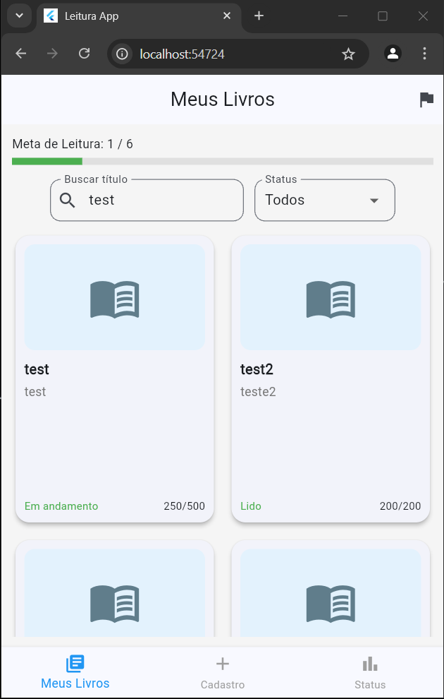
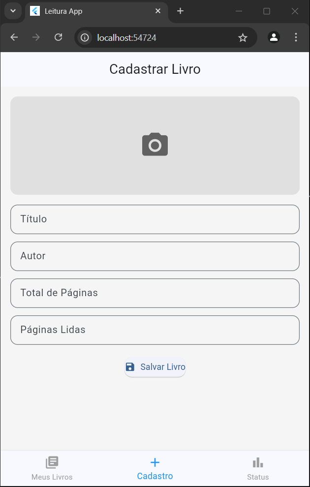

# 📚 App de Monitoramento de Metas de Leitura

Este aplicativo permite que o usuário cadastre livros, acompanhe o progresso de leitura e defina metas para monitorar seus hábitos de leitura.

---

## 🧠 Funcionalidades

- ✅ Cadastro de livros com título, autor, total de páginas, páginas lidas e imagem de capa
- 📖 Listagem dos livros com status: A iniciar, Em andamento, Concluído
- 🔍 Filtro por nome e por status
- 📈 Tela de progresso com barra indicativa de leitura por livro
- 🎯 Definição de meta de livros a serem lidos
- 📊 Barra de progresso geral em relação à meta
- 💾 Armazenamento local com SharedPreferences (persistência de dados)

---

## 🖼️ Capturas de Tela

### Tela Inicial - Meus Livros


### Tela de Progresso


### Tela de Cadastro de Livro


### Tela de Meta


---

## 🚀 Como Executar

1. Clone o repositório:
```bash
git clone https://github.com/victorhnj/leituraapp.git
cd leituraapp
```

2. Instale as dependências:
```bash
flutter pub get
```

3. Execute o app:
```bash
flutter run
```

---

## 🛠️ Tecnologias Utilizadas

- [Flutter](https://flutter.dev/) 3.x
- [Dart](https://dart.dev/)
- [SharedPreferences](https://pub.dev/packages/shared_preferences)
- [Image Picker](https://pub.dev/packages/image_picker)

---

## 📦 Estrutura do Projeto

```plaintext
lib/
├── main.dart                # Ponto de entrada
├── models/book.dart         # Modelo de dados para livros
├── services/book_storage.dart  # Persistência de dados
└── screens/
    ├── add_book_screen.dart
    ├── home_screen.dart
    ├── progress_screen.dart
    └── meta_screen.dart
```

---

## ✨ Autor
- Victor Hugo das Neves de Jesus

Se você gostou do projeto, ⭐ marque esse repositório no GitHub!

---

## 📄 Licença

Este projeto é de uso educacional e sem fins lucrativos.
